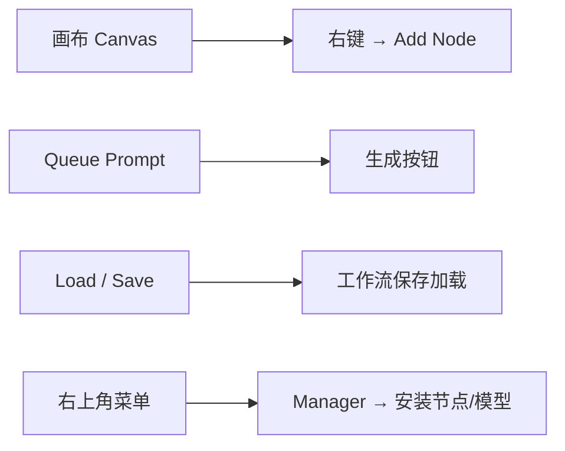
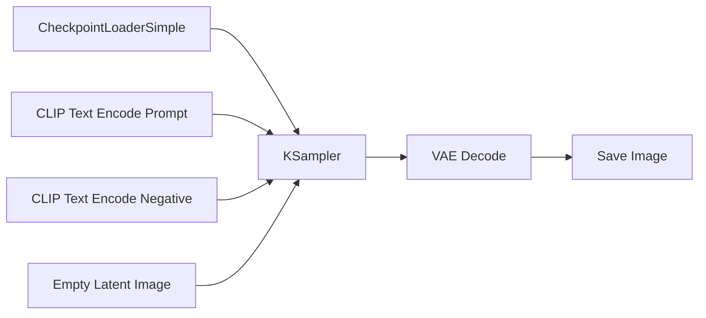
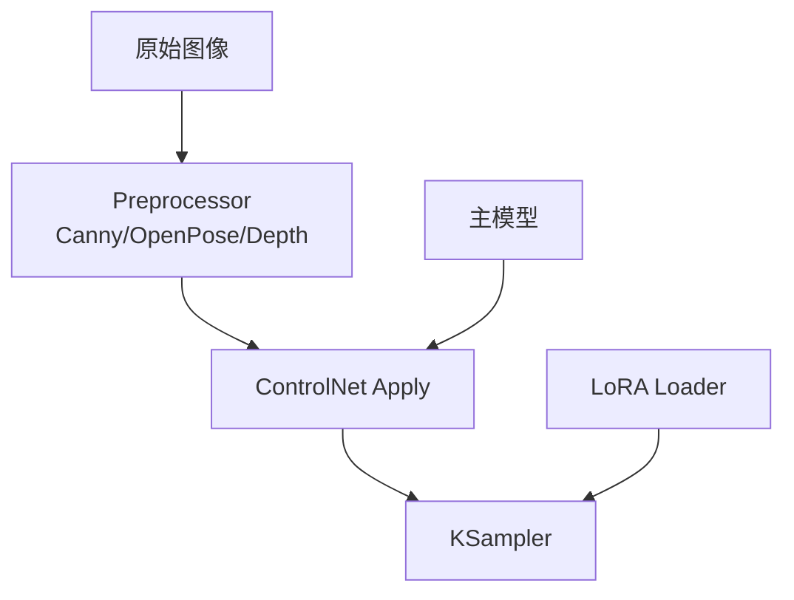
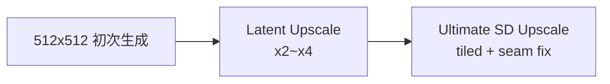
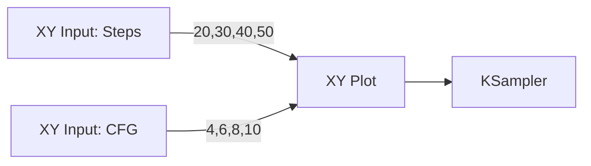

## 什么是 ComfyUI

ComfyUI 是目前最强大、最灵活的 Stable Diffusion WebUI 替代方案。它完全基于**节点图（Node Graph）**的方式构建工作流，与传统 A1111、Forge 等「填表格式」界面完全不同。

优点非常明显：

- 工作流完全可视化、可保存、可分享
- 极高的自定义能力，几乎没有功能上限
- 支持复杂条件分支、循环、批量处理
- 显存利用率极高，跑 4K、视频、长图都更省显存
- 更新速度极快，几乎每天都有新节点
  
  ```mermaid
  graph TD
   A[传统 WebUI] -->|填参数 → 点击生成| B[一张图]
   C[ComfyUI] -->|拖节点 → 连线| D[无限可能的工作流]
   style C fill:#91cc75,stroke:#333
   style D fill:#5470c6,stroke:#333
  ```
  

---

## 安装与启动（2025 年最新方式）

### 方法一：官方 Portable 版（推荐新手）

```Bash
# Windows
git clone https://github.com/comfyanonymous/ComfyUI.git
cd ComfyUI
git pull
python main.py
```

### 方法二：ComfyUI-Manager 一键安装（最省事）

2025 年最推荐的方式：

```Bash
git clone https://github.com/ltdrdata/ComfyUI-Manager.git custom_nodes/ComfyUI-Manager
# 然后直接运行官方 portable 包即可
```

启动后浏览器打开 http\://127.0.0.1:8188

---

## 界面速览



---

## 第一个图：Hello World 工作流

让我们用最经典的 3 个节点生成第一张图：



实际操作步骤：

1. 右键 → Load Checkpoint → 选择你的模型（如 realisticVision.safetensors）
2. 右键 → CLIP Text Encode (Prompt) → 输入 beautiful girl, masterpiece
3. 右键 → Empty Latent Image → 512×512
4. 右键 → KSampler → 默认参数即可
5. 右键 → VAE Decode + Save Image
6. 连线 → 点击 Queue Prompt

恭喜！你已经跑通第一个 ComfyUI 工作流！

---

## 核心概念：节点、连线、队列

| 概念  | 说明  |
| --- | --- |
| 节点 Node | 每个方块就是一个功能模块 |
| 连线 Link | 数据流向，颜色不同代表不同类型（绿色=Latent，红色=Model，黄色=CLIP） |
| Queue Prompt | 相当于「生成」按钮 |
| Group | 选中多个节点 → 右键 → Group → 可折叠收起 |

---

## 常用核心节点详解

### 必会节点 TOP 10

| 节点名称 | 作用  | 推荐参数 |
| --- | --- | --- |
| CheckpointLoaderSimple | 加载主模型 | -   |
| CLIP Text Encode (Prompt) | 正向提示词 | -   |
| KSampler / KSampler Advanced | 核心采样器 | steps: 20\~30, CFG: 6\~8, scheduler: dpmpp\_2m |
| Ultimate SD Upscale | 高清放大最佳工具 | tiling, upscale by 2.0 |
| ControlNet Preprocessor + Apply | ControlNet 使用 | preprocess 先，apply 后 |
| LoRA Loader | 加载 LoRA | strength 0.6\~1.0 |
| Image Resize / Latent Upscale | 调整图像/潜空间尺寸 | -   |
| Preview Image / Save Image | 查看与保存 | -   |
| XY Input / Plot | 参数扫描、批量生成神器 | -   |
| Efficiency Nodes / ComfyUI-Impact-Pack | 各种实用工具合集 | 强烈推荐安装 |

---

## 模型管理与加载策略

### 推荐目录结构（2025 标准）

```textile
ComfyUI/
├── models/
   ├── checkpoints/          # 主模型 .safetensors
   ├── loras/                # LoRA
   ├── controlnet/           # ControlNet 模型
   ├── vae/                  # VAE
   ├── clip/                 # CLIP 相关
   ├── upscale_models/       # ESRGAN/4x 放大模型
   └── embeddings/           # Textual Inversion
```

### 省显存加载技巧

```diff
- 每次都加载完整模型 → 显存爆炸
+ 使用 Model Loader + Unloader 节点实现按需加载卸载
+ 使用 --lowvram 或 --medvram 启动参数
+ 使用 ComfyUI-Manager 的 "Efficiency Nodes" 中的 "Free Memory" 节点
```

---

## Prompt 工程技巧（ComfyUI 专属）

### 动态 Prompt：使用 Wildcards + ComfyUI-Wildcards 节点

```markdown
一个穿着 {red|blue|white} 连衣裙的女孩，站在 {beach|forest|city} 中，masterpiece
```

### 分步 Prompt：使用 Prompt Control 系列节点实现 A→B 渐变

---

## ControlNet 与 LoRA 最佳实践



2025 年最强组合：

- OpenPose Full + Depth Anything V2 + Canny 组合使用
- ControlNet Union（单个模型支持 10+ 种控制）
- InstantLoRA + LoRA Stack 节点（一次加载多个 LoRA）

---

## 高分辨率修复与分块瓦片



推荐工作流：Base → Upscale by 2 → Ultimate SD Upscale (seamless tiling)

---

## 批量生成与参数扫描（XY Plot 神器）



可同时扫描 8 个参数，自动生成对比图。

---

## 性能优化与显存管理（2025 版）

| 显卡  | 可跑最高分辨率 | 推荐启动参数 |
| --- | --- | --- |
| RTX 3060 6GB | 1024×1024 | --medvram --disable-smart-memory |
| RTX 4070 12GB | 2048×2048 | --normalvram |
| RTX 4090 24GB | 4K+视频生成 | 默认即可 |

必装性能节点包：

- ComfyUI-Efficiency-Nodes
- ComfyUI-Impact-Pack
- ComfyUI-Manager

---

## 常见问题与排错

| 问题  | 解决方案 |
| --- | --- |
| 红框报错 | 查看右上角错误日志，通常是节点连线错误或模型路径不对 |
| 生成全黑/全绿图 | VAE 没接或 VAE 模型损坏 |
| 显存爆炸 | 使用 --lowvram，或加 Efficiency Nodes 卸载节点 |
| 节点找不到 | 打开 Manager → Install Missing Custom Nodes |
| 模型加载失败 | 检查模型是否放在正确文件夹，或重启 ComfyUI |

---

## 推荐扩展与自定义节点（2025 必装榜）

| 节点包 | 功能  | 安装方式 |
| --- | --- | --- |
| ComfyUI-Manager | 节点/模型管理器 | 必装  |
| ComfyUI-Impact-Pack | 超多实用工具 | 必装  |
| Efficiency Nodes | 省显存 + 高性能节点 | 必装  |
| rgthree-comfy | 节点连线优化、快速复制等 | 强烈推荐 |
| ComfyUI-WD14-Tagger | 自动打标 | 推荐  |
| ComfyUI-VideoHelperSuite | IPAdapter / 动图 / 视频生成 | 视频党必装 |
| ComfyUI-Ultimate-SD-Upscale | 最佳放大节点 | 必装  |

---

## 结语

ComfyUI 已经彻底超越传统 WebUI，成为 2025 年 AI 绘画的「生产力之王」。 它虽然有一定学习曲线，但一旦掌握，你会发现：

> **没有 ComfyUI 做不到的功能，只有你还没找到对应的节点。**

把这篇指南保存为 comfyui-handbook.md，直接丢进你的博客，随时查阅。

祝你玩得开心，生成愉快！

```typograms
   +-------------------+
   |     ComfyUI       |
   |   Master 2025     |
   |   You can do it!  |
   +-------------------+
          \   ^   /
           \  |  /
            \ | /
             \|/
              V
        出图如丝般顺滑
```

—— End of ComfyUI 完全使用说明书 ——