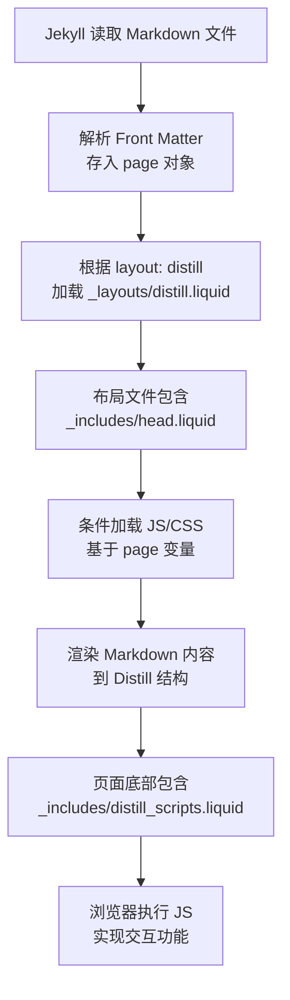
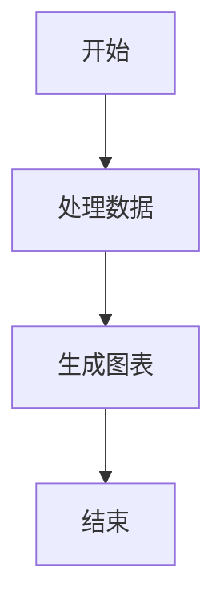

## 一、Distill 布局介绍

`layout: distill` 是 al-folio 主题中一个特殊的布局类型，专门用于创建具有学术论文风格、交互性强的博客文章。它模仿了 distill.pub 网站的优雅设计，允许一篇博客文章（通常放在 `_posts/` 文件夹）启用多种交互式、视觉化功能，支持多种高级功能。

### 核心特点：
1. **学术化排版**：使用 `<d-article>`, `<d-title>`, `<d-byline>` 等语义化标签
2. **交互式元素**：支持图表、数学公式、代码差异对比等
3. **响应式设计**：适配移动端和桌面端
4. **增强的可读性**：优化的字体、间距和色彩对比

### 整体结构和调用逻辑
- **front matter** 是 YAML 格式的页面元数据，Jekyll 在构建站点时会解析它。
- 当页面指定 `layout: distill` 时，Jekyll 会加载 `_layouts\distill.liquid`（al-folio 的自定义布局文件）。
- 这个布局文件使用 **Liquid 模板语言**（Jekyll 的核心）检查 front matter 中的变量：
  - 如果变量为 `true`，则在 `<head>` 或页面特定位置 **条件性地包含 JS/CSS 脚本**（如 Mermaid.js、Chart.js 等）。
  - 或者生成特定 HTML 结构（如侧边栏 TOC、评论区）。
  - 或者修改页面行为（如突出显示在首页）。
- 内容主体（Markdown）会被渲染成 `<d-article>` 结构，支持 Distill 风格的特殊标签（如 `<d-figure>`、`<d-code>` 等）。

### 文件结构：

项目结构如下：
<figure>
  <pre style="font-family: Menlo, Monaco, Consolas, 'Courier New', monospace; font-size: 0.9em;">
/
├─ _posts/
│  └── 2026-01-20-front-matter-layout-distill.md
├─ _layouts/
│  └── distill.liquid
└─ _includes/
   └── distill_scripts.liquid
  </pre>
  <figcaption style="color:white">项目文件结构（关键部分）</figcaption>
</figure>

>**核心文件解析**
* **distill.liquid（布局主文件）**
* **distill_scripts.liquid（脚本管理）**
FrontMatter功能实现的核心，通过`Liquid`条件语句动态加载资源。

## 二、Front Matter 调用逻辑详解

### 1. **基础工作流程**

当 Jekyll 构建站点时，会按照以下流程处理：



#### 如何工作（简化调用流程）
1. Jekyll 读取 Markdown 文件 → 解析 front matter → 把变量存入 `page` 对象（如 `page.mermaid.enabled`）。
2. 渲染时加载 `distill.liquid` 布局。
3. 内容主体被渲染后，JS 脚本在浏览器端处理交互（如 Mermaid 渲染图表、TikZJax 编译 LaTeX 绘图）。

### 2.**变量的作用、调用方式和逻辑**

| Front Matter 变量          | 类型       | 作用与调用逻辑                                                                 |
|----------------------------|------------|--------------------------------------------------------------------------------|
| **layout: distill**       | 字符串    | 核心！指定使用 Distill 风格布局（`_layouts/distill.liquid`）。没有这个，所有其他变量无效。布局会包裹内容在 `<d-article>` 中，支持 Distill 的交互式元素。 |
| **title**                 | 字符串    | 标准 Jekyll 变量，用于页面 `<title>` 和文章标题显示。Distill 布局会特别美化标题区。 |
| **description**           | 字符串    | 用于 SEO meta description，也可能在卡片式预览中显示。Distill 布局会在头部添加 meta 标签。 |
| **date**                  | 日期      | 标准变量，用于文章日期显示和排序。如果是未来日期，默认不发布（可通过 `_config.yml` 的 `future: true` 覆盖）。 |
| **featured: true**        | 布尔      | 让这篇文章在首页（Latest Posts 或 Featured 区）突出显示（如更大卡片或置顶）。布局检查 `page.featured` 并添加 CSS 类或优先排序。 |
| **tags**                  | 数组      | 标准标签，用于分类和标签云。Distill 布局会在文章底部显示标签列表。 |
| **giscus_comments: true** | 布尔      | 启用 Giscus 评论系统（基于 GitHub Discussions 的轻量评论）。布局在文章末尾条件性插入 Giscus script 和 `<div id="giscus-comments">`。需在 `_config.yml` 中预先配置 Giscus。 |
| **mermaid:**<br>  enabled: true<br>  zoomable: true | 对象/布尔 | 启用 Mermaid.js 支持流程图/时序图等。<br>- `enabled: true`：在 `<head>` 加载 Mermaid JS 并初始化。<br>- `zoomable: true`：额外启用点击放大功能（通过 JS 扩展）。<br>使用方式：在 Markdown 中写 ```mermaid:disable-run
| **code_diff: true**       | 布尔      | 启用代码差异高亮（diff 查看，如 Git 风格 +/− 行）。布局会加载相关 JS（如 diff2html），并对特定代码块应用差异渲染。适合展示代码变更。 |
| **chart:**<br>  chartjs: true<br>  echarts: true | 对象/布尔 | 启用图表支持。<br>- `chartjs: true`：加载 Chart.js 库，支持柱状图/折线图等。<br>- `echarts: true`：加载 ECharts 库（更强大，支持复杂交互图）。<br>使用方式：在 Markdown 中用特定代码块或 HTML 嵌入图表配置。 |
| **tikzjax: true**          | 布尔      | 启用 TikZJax（LaTeX 绘图工具 TikZ 的 JS 渲染版）。布局加载 TikZJax 脚本。<br>使用方式：在 Markdown 中写 ```tikz ... \begin{tikzpicture} ... \end{tikzpicture} ``` 代码块渲染矢量图。 |
| **toc:**<br>  - name: ... | 数组      | 手动定义目录（Table of Contents）。Distill 布局会根据这个数组生成侧边栏或浮动 TOC（通常是可滚动的目录树）。<br>每个 `- name: xxx` 对应文章中的一个章节标题（需匹配 H2/H3）。如果不设，某些版本可能自动生成（依赖 jekyll-toc 插件）。 |


### 3. **Front Matter 变量详细说明**

#### **布局控制**

```yaml
layout: distill  # 必需！指定使用 Distill 布局
```

#### **内容元数据**


title: "文章标题"           # 显示在 <h1> 和浏览器标签
description: "文章描述"     # SEO 和卡片预览
date: 2026-01-20           # 发布日期，控制显示和排序
featured: true             # 在首页突出显示
tags: [Jekyll, layout]     # 分类标签


#### **交互功能配置**

# 1. Mermaid 图表
mermaid:
  enabled: true     # 启用 Mermaid.js
  zoomable: true    # 支持图表缩放

# 2. 代码差异对比
code_diff: true     # 启用 diff2html

# 3. 图表库
chart:
  chartjs: true     # 启用 Chart.js
  echarts: true     # 启用 ECharts
  plotly: true      # 启用 Plotly
  vega_lite: true   # 启用 Vega-Lite

# 4. LaTeX 绘图
tikzjax: true       # 启用 TikZ 绘图

# 5. 目录配置
toc:
  - name: "章节一"     # 手动定义目录结构
  - name: "章节二"


#### **社交与评论**

giscus_comments: true  # 启用 Giscus 评论系统
disqus_comments: true  # 启用 Disqus 评论


### 4. **使用示例**

#### **Mermaid 图表**




#### **TikZ 绘图**

```tikz
\begin{tikzpicture}
  \draw (0,0) circle (1cm);
  \draw (0,0) -- (1,1);
\end{tikzpicture}
```


#### **代码差异**

```diff
- const oldVersion = "1.0";
+ const newVersion = "2.0";
```


## 三、实践案例

### 1. **常见问题排查**

| 问题 | 可能原因 | 解决方案 |
|------|----------|----------|
| 功能未生效 | layout 不是 distill | 确认 Front Matter 第一行 |
| JS 加载失败 | 资源路径错误 | 检查 `_config.yml` 配置 |
| 未来文章未显示 | 日期未到 | 设置 `future: true` 或修改日期 |
| 样式错乱 | CSS 冲突 | 检查自定义样式 |

- 这些功能依赖 al-folio 的内置 JS（在 `assets/js/distillpub/` 下），确保你的仓库是最新版。
- 部分功能（如 TOC 自动生成）可能还需要额外插件（如 jekyll-toc），但 al-folio 已内置大部分。
- 如果某个功能不生效，检查：
  - 是否真的是 `layout: distill`（不是 `post`）。
  - 本地运行 `bundle exec jekyll serve` 查看控制台是否有 JS 加载错误。
  - 日期是否为未来（不会发布）。

### 2. **扩展功能**

如需添加自定义功能：

1. 在 Front Matter 中定义新变量：
   ```yaml
   custom_feature: true
   ```

2. 在 `distill.liquid` 或 `distill_scripts.liquid` 中添加条件逻辑：
   ```liquid
   
   
     <script src="/assets/js/custom.js"></script>
   
   
   ```


